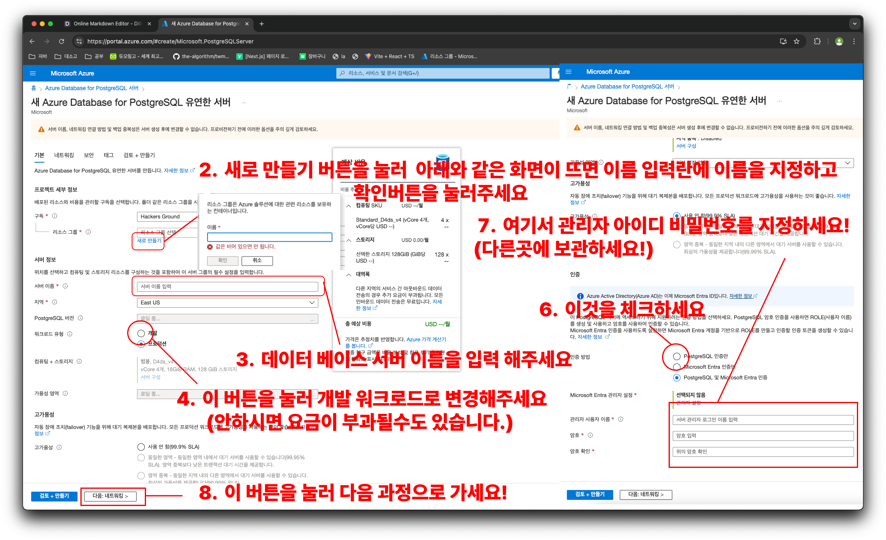

# `마늘장아찌` - `굿팜 (슬기로운 농사생활)`

해커그라운드 해커톤에 참여하는 `마늘장아찌` 팀의 `굿팜` 입니다.

## 참고 문서

> 아래 두 링크는 해커톤에서 앱을 개발하면서 참고할 만한 문서들입니다. 이 문서들에서 언급한 서비스 이외에도 더 많은 서비스들이 PaaS, SaaS, 서버리스 형태로 제공되니 참고하세요.

- [순한맛](./REFERENCES_BASIC.md)
- [매운맛](./REFERENCES_ADVANCED.md)

## 제품/서비스 소개

<!-- 아래 링크는 지우지 마세요 -->
[제품/서비스 소개 보기](TOPIC.md)
<!-- 위 링크는 지우지 마세요 -->

## 오픈 소스 라이센스

<!-- 아래 링크는 지우지 마세요 -->
[오픈소스 라이센스 보기](./LICENSE)
<!-- 위 링크는 지우지 마세요 -->

## 설치 방법

> **아래 제공하는 설치 방법을 통해 심사위원단이 여러분의 제품/서비스를 실제 Microsoft 애저 클라우드에 배포하고 설치할 수 있어야 합니다. 만약 아래 설치 방법대로 따라해서 배포 및 설치가 되지 않을 경우 본선에 진출할 수 없습니다.**

### PostgreSQL 생성 및 설정

> **사진을 참고하여 사친처럼 순서에 맞게 진행 해주세요!**
[AZURE에서 POSTGRES SQL](https://portal.azure.com/#browse/Microsoft.DBforPostgreSQL%2Fservers) (파란 버튼을 누르면 바로 이동합니다.) 를 구성 합니다 

1. 만들기 버튼을 눌러주세요! 

2. 구독 - 리소스 그룹에서 새로만들기 버튼을 눌러주세요 리소스 그룹 이름 입력창이 뜨면 이름 입력란에 이름을 지정하고 확인버튼을 눌러주세요.
3. 서버정보 - 서버 이름 - 서버 이름 입력 칸에 데이터 베이스 서버 이름을 입력 해주세요
4. 워크로드 유형 버튼을 눌러 개발 워크로드로 변경해주세요
5. 아래 까지 스크롤을 해주세요!
6. 인증 - 인증 방법 창에서 PostgreSQL 인증만 버튼을 눌러 주세요
7. 관리자 사용자 이름, 암호, 암호확인 란에 각각 내용을 입력해주세요.
8. 다음: 네트워킹 > 버튼을 눌러 다음과정으로 이동 하세요.

8. + 0.0.0.0 - 255.255.255.255 추가 버튼을 눌러주세요
9. Add 0.0.0.0 - 255.255.255.255 관련 경고창이 뜬다면 계속 버튼을 눌러주세요
10. 검토 + 만들기 버튼을 눌러주세요

11. 만들기 버튼을 눌러주세요

12. 대략 10분정도 기다리신다면 위와 같은 화면으로 서버가 생성 되십니다.

### Docker 설정

[Docker.io](https://www.docker.com/) (파란 버튼을 눌러 바로 이동하세요!)에 접속 해주세요!

1. Download for {자신의 OS} 버튼을 눌러 도커를 설치해주세요.

2. 다운로드에서 다운받은 Docker Desktop Installer 를 실행해주세요.

3. 관리자 권한 요청이 들어오면 예 버튼을 눌러주세요

4. 설치가 완료되면 close 버튼을 눌러주세요
  

5. 바탕화면으로 이동후 도커 아이콘을 눌러 실행 해주세요.

6. 도커 화면이 정상적으로 뜬다면 SKIP TUTORIAL 버튼을 눌러주세요

7. 잠시 기다리신후 이러한 화면이 뜬다면 정상적으로 설치 되신겁니다!

### 사전 준비 사항
- Docker
- 터미널 또는 명령 프롬포트 (CMD)
  
> **여러분의 제품/서비스를 Microsoft 애저 클라우드에 배포하기 위해 사전에 필요한 준비 사항들을 적어주세요.**

## 시작하기

> **여러분의 제품/서비스를 Microsoft 애저 클라우드에 배포하기 위한 절차를 구체적으로 나열해 주세요.**
